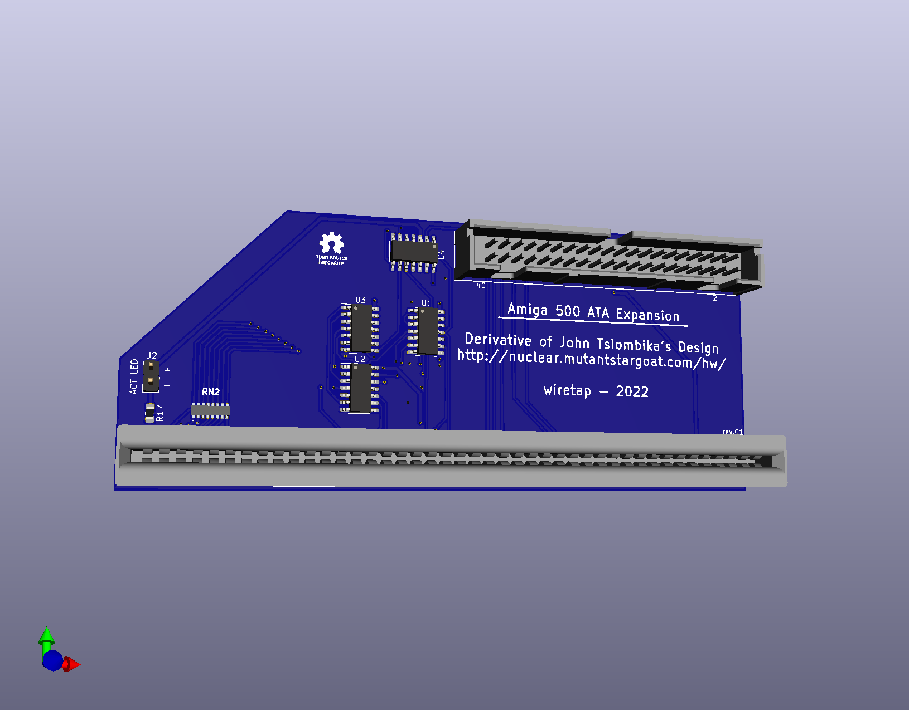

# A500 HDD Remake
A500 Side Expansion IDE

## Info
The A500 HDD Remake is an Amiga 500 ATA Expansion device that utilitizes ide.device to provide interface for a hard drive or CD-ROM. I use it in my A500 Tower, so I modified it with an activity light header and slightly different dimensions. 
\
\
Design attributed to John Tsiombika's A500hdd device, slightly modified. See additional details at: http://nuclear.mutantstargoat.com/hw
